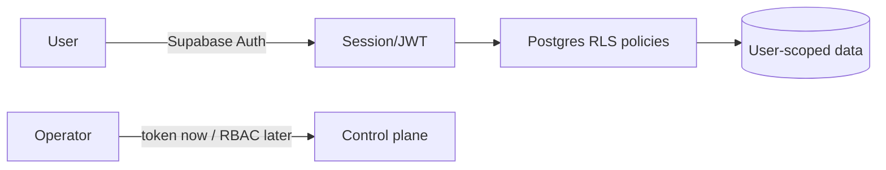

# Authentication & Authorization Architecture

_Last updated: 2026-05-26. Honest: there is no end-user auth yet._

## Current state (real)

- **No end-user authentication.** The product is currently public/read-only.
- **Supabase key separation.** The anon key (`getSupabaseClient`) is used for
  public reads; the service-role key (`getSupabaseServiceClient`) is server-only
  and used solely for privileged writes (affiliate event ingestion). They are
  separate config values and the service role is never shipped to the client.
- **RLS deny-by-default.** Authorization at the data layer is RLS: catalog tables
  are public-read, event tables are not publicly readable.
- **Admin control plane.** `/api/admin/*` is secure-by-default: disabled unless
  `JOURNEE_ADMIN_TOKEN` is set, then token-gated via `x-admin-token`.

## Intended model (roadmap)

- **Supabase Auth** for end users (email/OAuth), issuing JWTs consumed by RLS so
  authorization stays in the database (per ADR-002).
- **RBAC** for operators replacing the interim admin token; admin actions
  audit-logged.
- Least-privilege keys per environment.

These depend on the data platform + hosted project (externally blocked) and are
**not** implemented yet.

## Principles

- Authorization at the data layer (RLS), not just the app layer.
- Secrets only at the server boundary; never inline; never in the client bundle.
- Secure-by-default for any privileged surface (deny unless explicitly enabled).
