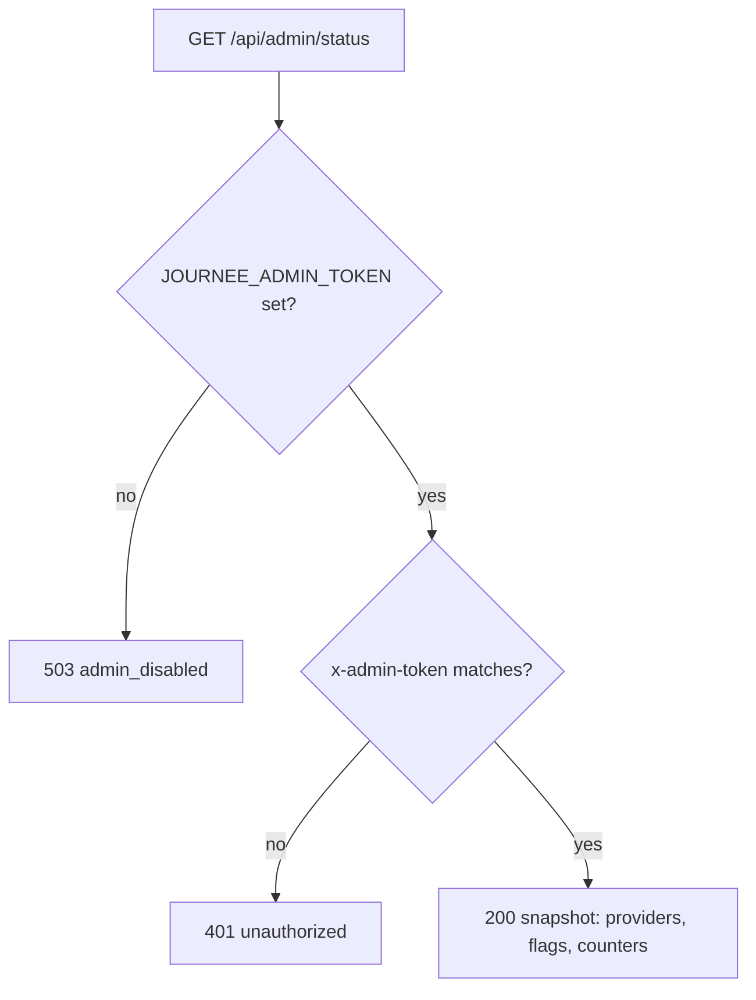

# Admin / Control-Plane Architecture

_Last updated: 2026-05-26._

## Status

- **Read-only status endpoint:** ✅ `GET /api/admin/status`.
- **Mutating control plane (toggle flags, manage campaigns) + real auth/RBAC:**
  🔜 roadmap (depends on auth, not yet built).

## Purpose

Give operators a single, honest view of runtime state — which providers are
registered and available, which flags are on, and the current counters — without
SSHing into anything or reading logs. This is the seed of an operational control
plane.

## Security model (secure by default)

- **Disabled unless explicitly enabled.** With no `JOURNEE_ADMIN_TOKEN`, the
  endpoint returns 503 — it cannot leak internals by accident.
- **Token-gated when enabled.** A shared secret in the `x-admin-token` header.
  This is a pragmatic first control; it will be replaced by real auth + RBAC
  (roadmap) and should sit behind network restrictions in production.
- **Read-only.** No mutation is exposed yet, limiting blast radius.

## What it reports

| Field | Source |
| --- | --- |
| `providers[]` | `allProviders()` — id, name, capability, priority, `available` |
| `flags` | `KNOWN_FLAGS` × `isFeatureEnabled` |
| `counters` | `getCounters()` (provider resolve/failover/exhaustion) |

## Roadmap

Authentication + RBAC, audit logging of admin actions, and mutating operations
(flag toggles, campaign management) come with the auth system. Each mutating
action will be audit-logged and append to the AI/operator audit trail.
