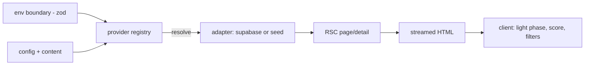
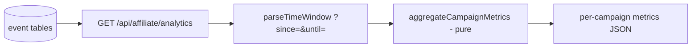

# Data-Flow Architecture

_Last updated: 2026-05-26._

## Read path (catalog → page)



Config and content enter only through the boundary modules; pages never read
`process.env` or import a vendor SDK directly.

## Affiliate write path (ingestion)

```mermaid
flowchart LR
  C[client click/convert] --> EP[POST /api/affiliate/click|conversion]
  EP --> V[zod validate -> 400]
  V --> SRV{service client?}
  SRV -- no --> R503[503 unconfigured]
  SRV -- yes --> INS[insert event row]
  INS --> T[(event tables - RLS write-only)]
```

## Affiliate read/analytics path



## Trust boundaries

| Boundary | Control |
| --- | --- |
| Client → API | zod validation; only booleans exposed by health; admin token-gated |
| App → DB (read) | anon key + RLS public-read |
| App → DB (write) | service-role key, server-only, deny-by-default RLS |
| App → external providers | adapter choke point (single place to audit egress) |

## Notes

Intelligence signals (e.g. solar light phase) are computed client-side from
public coordinates + the clock — no PII, no network. Attribution tokens are
opaque and carry no PII.
