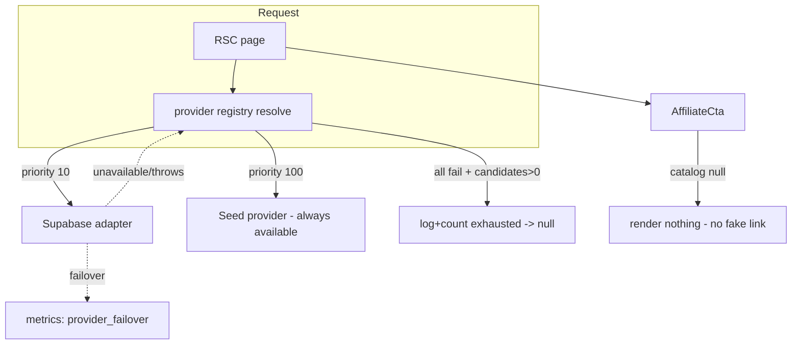

# Failure Domains & Recovery

_Last updated: 2026-05-26. Describes the real failure behavior of the current
system; hosted-infra specifics are marked roadmap._

## Failure domains

| Domain | Blast radius | Isolation | Fallback |
| --- | --- | --- | --- |
| Rendering (Next.js) | Whole app | — (core) | Redeploy last green build |
| Destinations provider | Catalog source | Behind registry + `isAvailable()` | Always-available seed provider |
| Affiliate catalog | Monetization CTAs | Registry capability `affiliate` | No CTA rendered (renders null) |
| Affiliate ingestion | Event writes | Server-only routes | 503 (honest), no UI impact |
| Weather (mock today) | One signal | Provider contract + null-when-unavailable | No weather signal; score confidence drops |
| Build-time fonts | Builds only | — | Self-host (roadmap) |

Key property: **no single external dependency can take down rendering** — every
data dependency is behind a provider that degrades to a fallback.

## Failure propagation & containment

Failover is contained at the registry: a throwing/unavailable provider is logged
and counted, never propagated to the page.

## Recovery pathways

Operational recovery steps live in [`../runbooks/recovery.md`](../runbooks/recovery.md).
Summary:

- **Bad deploy →** `git revert` the merge → CI → redeploy (forward fix).
- **Provider/backed down →** automatic fallback holds the UI; fix
  config/backend and the provider re-enables via `isAvailable()` with **no
  deploy**.
- **Misbehaving provider →** disable its feature flag (config change).

## Observability hooks

- `GET /api/health` — config presence + status.
- `GET /api/metrics` — `provider_resolve_success`, `provider_failover`,
  `provider_capability_exhausted` counters.
- Structured logs keyed by stable `msg` event names.

## Roadmap

RPO/RTO targets, backup/restore drills, multi-region, and alerting depend on
hosted infrastructure that is not yet provisioned (externally blocked). They
will be documented against real systems, not assumed.
