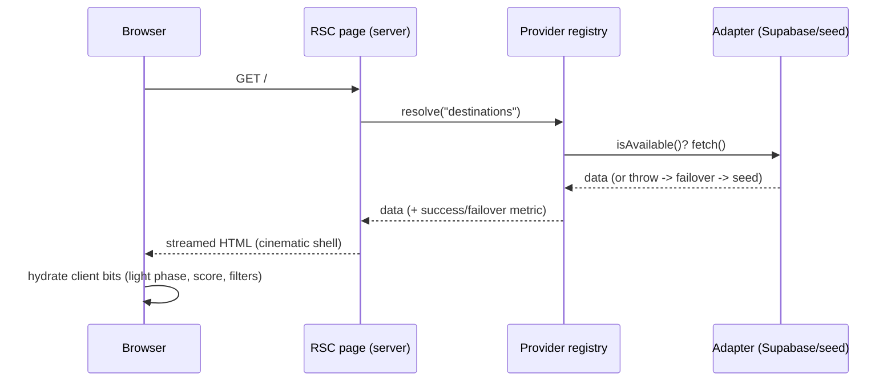

# System Architecture

_Last updated: 2026-05-26. Reflects the codebase as it actually exists today._

## Purpose

Journee is a cinematic travel-intelligence platform. This document describes the
**current** architecture and the seams designed to absorb future growth.

## Current shape

```
                ┌─────────────────────────────────────────────┐
   Browser ───▶ │  Next.js 15 App Router (Server Components)   │
                │                                              │
                │  src/app/page.tsx (RSC)                      │
                │     │ resolve("destinations")                │
                │     ▼                                        │
                │  lib/providers/registry  ── priority/fallback│
                │     │                                        │
                │     ▼                                        │
                │  lib/providers/destinations.local (seed)     │
                │     │ reads                                  │
                │     ▼                                        │
                │  content/destinations.ts (typed catalog)     │
                └─────────────────────────────────────────────┘
```

Rendering is server-first. Interactive pieces (e.g. `QuoteRotator`,
`LightBadge`, `AtmosphericScore`) are small, explicitly-marked Client Components.

## Request lifecycle



See [`failure-and-recovery.md`](failure-and-recovery.md) for failover/recovery
diagrams.

## Layers

| Layer | Location | Responsibility |
| --- | --- | --- |
| Presentation | `src/app`, `src/components` | Routing, layout, cinematic UI. Components take data via props. |
| Content | `src/content` | Typed seed catalog. Shape matches what a provider will return. |
| Configuration | `src/lib/config` | Single source for site copy/config — the no-hardcoding seam. |
| Providers | `src/lib/providers` | Vendor-agnostic capability contracts + routing/fallback. |

## Design system

The cinematic/editorial/luxury identity is encoded as tokens in
`src/app/globals.css` (`@theme`): Playfair Display for headings, Montserrat for
body, a warm ink/sand palette with gold accents, plus restrained ambient motion
(Ken Burns drift, fade-up) that respects `prefers-reduced-motion`. Components
reference tokens, never raw hex.

## Key seams (designed for growth)

- **Provider registry.** Application code calls `resolve(capability)`, not a
  vendor SDK. New data sources register as adapters. See
  [`provider-architecture.md`](provider-architecture.md).
- **Configuration boundary.** Copy and structural content come from
  `lib/config` / `content`, so a CMS or DB-backed config provider can replace
  the source without UI changes. See
  [`configuration-architecture.md`](configuration-architecture.md).

## What exists now vs. not yet

Built since the first foundation: API routes (`/api/health`, `/api/metrics`,
`/api/destinations`, `/api/affiliate/*`, `/api/admin/status`), the affiliate
vertical, intelligence engines + scoring, observability, and detail pages. Still
**not** built: end-user auth, a hosted database, and live external data feeds
(see the engine + dependency docs and the continuation handoff). The data
platform direction is recorded in
[ADR-002](../decisions/ADR-002-supabase-data-platform.md).

## Dependencies (today)

| Dependency | Why | If unavailable |
| --- | --- | --- |
| Next.js / React | App framework & rendering | App cannot build/run (dev-time only). |
| Brand fonts (self-hosted, `@fontsource-variable`) | Brand typography | Bundled with the build — no network dependency. |
| Unsplash (runtime images) | Seed imagery | Cards show broken images; allow-listed in `next.config.mjs`. Replace with owned/licensed assets before launch. |

## Scaling considerations

Server Components keep client JS small. The provider registry centralizes
failover so adding caching, timeouts, and circuit-breaking is a single-location
change. As real engines arrive they should be modular services behind the same
provider contracts rather than inline logic in routes.
