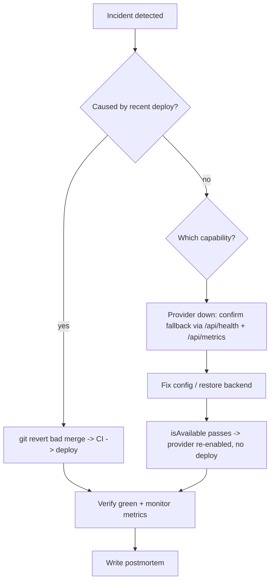

# Runbook: Recovery

_How to restore service for each known failure mode. Scoped to what exists._

## Deploy rollback (SEV1)

The fastest mitigation for a bad release is to redeploy the last known-good
build. Because every change lands via PR + green CI (typecheck/lint/test/build),
the previous commit on `main` is a safe target.

```bash
# Identify last good commit, then revert the offending merge:
git revert <bad-merge-sha>      # creates a new commit; push -> CI -> deploy
```

Prefer `git revert` (forward fix) over force-pushing history.

## Provider / capability recovery

The provider registry fails over automatically: if a higher-priority provider is
unavailable or throws, the next one answers, down to the always-available seed.

| Failure | Automatic behavior | Manual recovery |
| --- | --- | --- |
| Supabase destinations down | Falls back to seed catalog | Restore Supabase / fix `.env`; provider re-enables when `isAvailable()` passes — no deploy. |
| Affiliate catalog unavailable | No affiliate CTA rendered | Restore Supabase + `affiliate-catalog` flag. |
| A provider misbehaving | Disable its feature flag | Toggle flag (config change, no deploy). |

Verify recovery via `GET /api/health` and a falling `provider_failover` rate at
`GET /api/metrics`.

## Database recovery (roadmap detail)

For a hosted Supabase project, recovery uses managed point-in-time backups
(`supabase` dashboard / CLI). Concrete RPO/RTO targets and a tested restore
drill will be documented once a hosted project exists — not claimed before then.
Locally, `supabase db reset` rebuilds schema + seed from
`supabase/migrations/*` and `supabase/seed.sql`.

## Recovery flow


